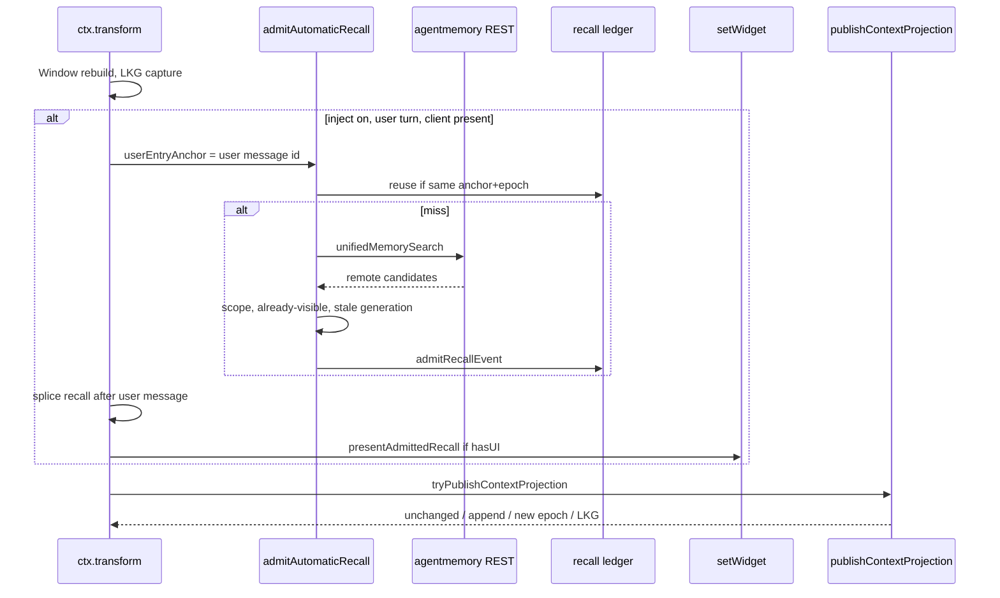

# Implementation

How the features in [features.md](features.md) are wired. Bridge code lives
under `src/agentmemory/`. Projection store and coordinator live under
`src/core/features/`. Transform hooks live in `src/context-handler.ts`.
Registration is `src/index.ts`.

coding-agent is not part of this path: `ephemeralMessage` was removed and must
not return. Recall never uses `sendMessage` or session JSONL.

## Ownership

| Owner              | Owns                                                                                | Does not own                         |
| ------------------ | ----------------------------------------------------------------------------------- | ------------------------------------ |
| agentmemory Docker | Cross-session facts, ranking, graph, consolidation, REST                            | Window, projection, TUI              |
| omp-mctx           | Window, Context Projection, admission, replay, TUI presentation, outbox, Scope Gate | Backend schema or ranking            |
| coding-agent       | Generic extension lifecycle, UI, provider conversion                                | AgentMemory-specific ephemeral state |

## Module map

### Spec 1 — bridge

| Module                             | Role                                                            |
| ---------------------------------- | --------------------------------------------------------------- |
| `src/agentmemory/config.ts`        | Settings, env overrides, `formatAutomaticRecallStatus`.         |
| `src/agentmemory/client.ts`        | Public REST client, timeouts, error kinds.                      |
| `src/agentmemory/project.ts`       | Project identity resolution.                                    |
| `src/agentmemory/security.ts`      | HTTPS / secret fail-closed.                                     |
| `src/agentmemory/bridge.ts`        | Runtime: client, session manager, health.                       |
| `src/agentmemory/session.ts`       | One capture segment per OMP session per activation.             |
| `src/agentmemory/capture.ts`       | Async observe; redaction; memory-tool exclusion.                |
| `src/agentmemory/memory-search.ts` | Federated `memory_search`, Scope Gate, source-identity details. |
| `src/agentmemory/inject-save.ts`   | `memory_save` enqueue, taint store, health helper.              |
| `src/agentmemory/historian.ts`     | Independent-evidence gate, retrieval-derived blocking.          |
| `src/agentmemory/outbox.ts`        | Atomic remember outbox, lease, retry.                           |
| `src/pi-historian-runner.ts`       | Host-entry taint walk; skips tainted recall users.              |

### Spec 2 — projection

| Module                                                | Role                                                        |
| ----------------------------------------------------- | ----------------------------------------------------------- |
| `src/agentmemory/recall-ledger.ts`                    | Epochs, Recall Events, sources, receipts, GC.               |
| `src/agentmemory/recall-admission.ts`                 | Retrieve → filter → admit; generation / stale discard.      |
| `src/agentmemory/recall-presentation.ts`              | Sanitized `setWidget` display; presentation receipts.       |
| `src/core/features/context-projection.ts`             | Projection rows, bootstrap / append / transition, LKG.      |
| `src/core/features/context-projection-coordinator.ts` | Classify unchanged / append / epoch; privacy withdrawal.    |
| `src/context-handler.ts`                              | Transform hook: admit, splice after user, present, publish. |

## Settings → runtime

`src/index.ts` reads plugin settings through `resolveAgentMemorySettings`.
`agentmemory.enabled` must be true or no client is constructed.

When the runtime exists:

- Capture, tools, and historian retrieval honor their kill switches.
- `automaticRecallAdmission` is `settings.inject`.
- The same `SqliteTurnTaintStore` is passed to historian and admission.
- Startup logs `ENABLED` / `DISABLED` / `UNAVAILABLE` via
  `formatAutomaticRecallStatus`.

## Transform path

Only a successful provider-facing transform publishes a projection. LKG replay
does not. Background historian / compartment work only notes a pending
transition reason.

Admission details:

1. `declarePreUpgradeEpoch` so a ledger epoch exists.
2. `listActiveBranchRecallEvents` — same `userEntryAnchor` + epoch returns
   `reused` and does not search.
3. `nextRecallGeneration` plus an AbortController; a newer generation marks
   in-flight work `stale`.
4. `unifiedMemorySearch` with empty local lane (the Window is already in the
   prompt). Scope Gate and already-visible substring filter run after.
5. Body bytes are rendered once and stored. Origin `direct_retrieval`,
   promotion `requires_independent_evidence`, dependency `user_entry`.
6. Optional taint: `markTurnTainted(eventId, "automatic-recall", eventId)` —
   the recall host entry, not the user turn.

The splice uses a user-role Pi message whose `id` is the event id so the
coordinator fold does not serialize the same event twice. Session JSONL is not
written.

## Projection classification

`publishContextProjection` serializes `{id,role,content}` as JSONL
(`stableStringify` per line) so a true append is a byte prefix.

| Observation                                           | Action                                                       |
| ----------------------------------------------------- | ------------------------------------------------------------ |
| No active projection                                  | Bootstrap on the current ledger epoch                        |
| Same body digest and contract                         | `unchanged` (pending refresh notes are consumed, not forced) |
| Same contract, previous body is a prefix              | `append`                                                     |
| Contract change, earlier bytes changed, or withdrawal | New ledger epoch + `transition`                              |

Pending notes from `signalPiHistoryRefresh` / system refresh / materialization
only label a later **real** wire or contract change. Identical bytes stay
`unchanged`.

Privacy withdrawal calls `withdrawProjectionPrivacy` (`withdrawsRecovery: true`)
then `gcUnreachableRecall`. `readLastKnownGoodContextProjection` is undefined
for a withdrawn head.

## `context.db` tables

Installed from `initializeDatabase` (Window + outbox + ledger + projection).
Additive `CREATE IF NOT EXISTS`; existing Window / outbox / taint / legacy rows
are not rewritten.

Recall ledger (`src/agentmemory/recall-ledger.ts`):

- `mctx_projection_epochs`, `mctx_projection_epoch_reachability`,
  `mctx_projection_heads`, `mctx_branch_lineage`
- `mctx_recall_events`, `mctx_recall_sources`, `mctx_recall_dependencies`
- `mctx_recall_presentation_receipts`, `mctx_recall_recovery_refs`

Context projection (`src/core/features/context-projection.ts`):

- `mctx_context_projection_states`, `mctx_context_projection_heads`

`gcUnreachableRecall` deletes an event only when `getRecallRetention` marks it
eligible (not current head, not reachable, no recovery ref). It does not search
or rank remote knowledge.

## TUI presentation

`presentAdmittedRecall`:

- No-op when `ctx.hasUI` is false or `setWidget` is missing (headless / RPC).
- `claimRecallPresentation` then `setWidget("agentmemory-recall", lines,
{ placement: "aboveEditor" })` then `completeRecallPresentation`.
- Lines go through `replaceTabs`, `shortenPath`, `truncateToWidth`. Stored
  event body bytes are not mutated.
- `setWidget` throw leaves the receipt claimed (not presented) so a later
  attempt can retry after the lease. The transform never throws.

`notify` is unused: it is a transient toast with no scrollback.

## Fail-closed

| Failure                    | Window     | Projection                | Recall                                     |
| -------------------------- | ---------- | ------------------------- | ------------------------------------------ |
| AgentMemory down at search | Continues  | Unchanged                 | No new event; admitted events still replay |
| Admission throws           | Continues  | Publish still runs        | Logged                                     |
| Projection publish throws  | Continues  | Previous LKG              | —                                          |
| Privacy withdrawal         | Continues  | No withdrawn LKG          | Eligible events may GC                     |
| Transform crash            | LKG replay | No publish on replay path | —                                          |

## Tests

`package.json` `scripts.test` is the allowed runner. Relevant files:

- `test/agentmemory-foundation.test.ts` — settings, health, capture, inject switch
- `test/agentmemory/memory-search.test.ts` — federation, scope, details
- `test/agentmemory/recall-ledger.test.ts` — identities, receipts, GC
- `test/agentmemory/recall-admission.test.ts` — admit / reuse / stale / fail
- `test/agentmemory/recall-presentation.test.ts` — widget, headless, no reprint
- `test/agentmemory/recall-recorded-wire.test.ts` — first/later/retry/branch/privacy/TCP down
- `src/core/features/context-projection*.test.ts` — store and coordinator
- `src/core/features/fail-closed-block.test.ts` — Window fail-closed
- `src/core/features/fresh-schema.test.ts` — additive schema, no fabricated history
